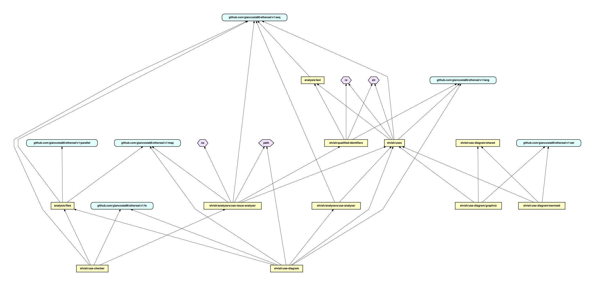
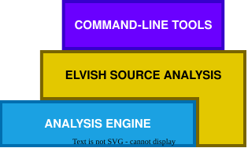

# primrose

_Elegant file analysis in Elvish_



**primrose** is a _toolkit_ for analyzing file content in the [Elvish](https://elv.sh/) shell; in particular, it features:

- a general-purpose **analysis infrastructure**

- _regex-based_ **analysis functions** for the **Elvish** language

- a **linter** for `use` declarations in **Elvish**, currently detecting:
  - **superfluous uses**

  - **dangling references** - _qualified identifiers_ having _no imports for their namespace_

  - **relative imports** pointing to _inexistent files_

* a **dependency diagram generator** for **Elvish**, emitting the _source code_ of a [Graphviz](https://graphviz.org/) or [Mermaid](https://mermaid.ai/) flowchart.

The _overall architecture_ can be summarized as follows:



## Installation

The library can be installed via **epm** - in particular:

```elvish
use epm

epm:install github.com/giancosta86/primrose
```

Even better, if you have [epm-plus](https://github.com/giancosta86/epm-plus), you can run:

```elvish
epm:install github.com/giancosta86/primrose@v1
```

or any other specific Git reference.

## Command-line tools

### Usage checker

To make this command available, it is recommended to add the following lines to **rc.elv**:

```elvish
use github.com/giancosta86/primrose/v1/elvish/use-checker

var check-uses~ = $use-checker:check-uses~
```

This will make the `check-uses` command globally available at the command prompt.

Then, in your project directory, just run

```elvish
check-uses
```

The command also supports more options - please, refer to the [module](elvish/use-checker.elv) documentation for details.

### Diagram generator

To make this command available, it is recommended to add the following lines to **rc.elv**:

```elvish
use github.com/giancosta86/primrose/v1/elvish/use-diagram

var use-diagram~ = $use-diagram:use-diagram~
```

This will make the `use-diagram` command globally available at the command prompt.

Then, in your project directory, just run

```elvish
use-diagram
```

The generated output can be procesed by tools supporting the selected syntax - in particular:

- the `dot` command for [Graphviz](https://graphviz.org/)

- Mermaid's [playground](https://mermaid.ai/play) or [command-line tool](https://www.npmjs.com/package/@mermaid-js/mermaid-cli).

For example, in the case of Graphviz:

```elvish
use-diagram &colors | dot -Tsvg -o use-diagram.svg
```

The command also supports more options - please, refer to the [module](elvish/use-diagram.elv) documentation for details.

## Elvish source analysis core

The most important modules for analyzing Elvish scripts - and the very heart of the related command-line tools - are:

- [qualified-identifiers](elvish/qualified-identifiers.elv) - to detect identifiers whose form is `<namespace>:<name>`.

- [uses](elvish/uses.elv) - listing all the occurrences of the `use` declaration.

They are extremely ⚡*fast*, because they are based on _regular expressions_ - but the lack of a veritable _expression tree_ makes them **not** 100%-infallible.

## General-purpose analysis

The `analyze` function, residing in the `analysis/files` module, runs **parallel analysis** of source files - representing the very heart of the entire library; please, refer to its [source file](analysis/files.elv) for the documentation and, even more, to its [test suite](analysis/files.test.elv) for examples using it.

Similarly, the `line-by-line` function in the `analysis/text` [module](analysis/text.elv) provides a valuable utility for analyzing text content.

## See also

- [Ethereal](https://github.com/giancosta86/ethereal) - _Elegant utilities for the Elvish shell_

- [Velvet](https://github.com/giancosta86/velvet) - _Smooth, functional testing in the Elvish shell_

- [epm-plus](https://github.com/giancosta86/epm-plus) - _Package versioning for epm in Elvish_

- [Graphviz](https://graphviz.org/) - _Open source graph visualization software_

- [Mermaid](https://mermaid.ai/) - _Faster, smarter diagramming for teams_

- [Elvish](https://elv.sh/)
